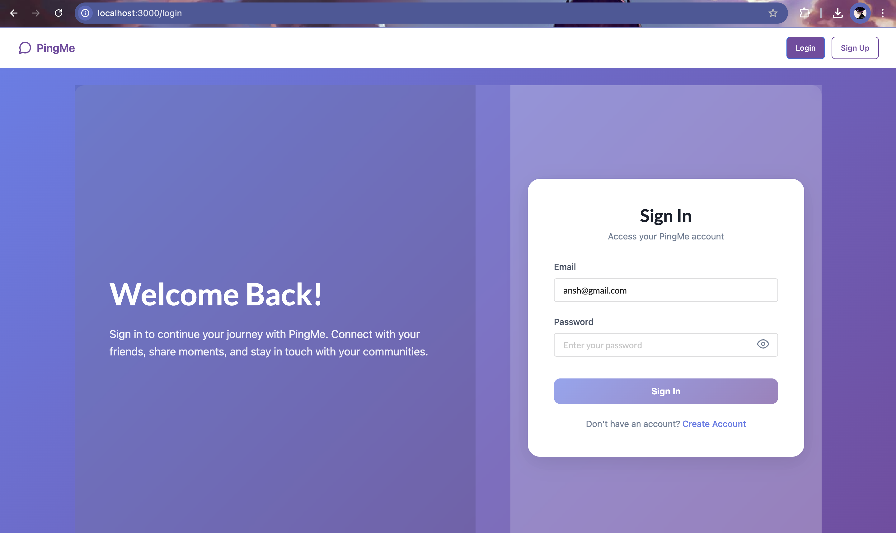
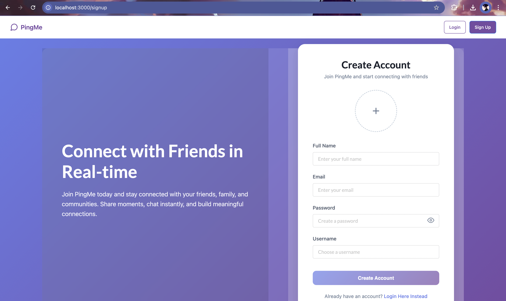
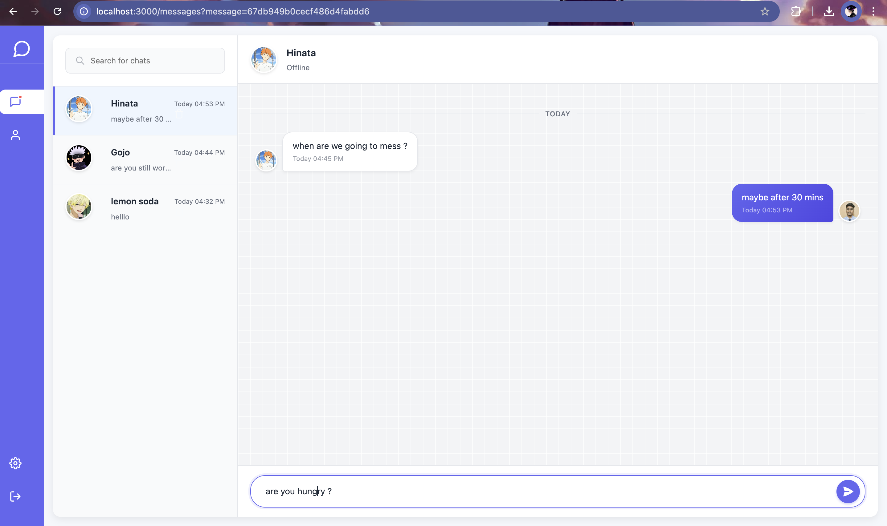
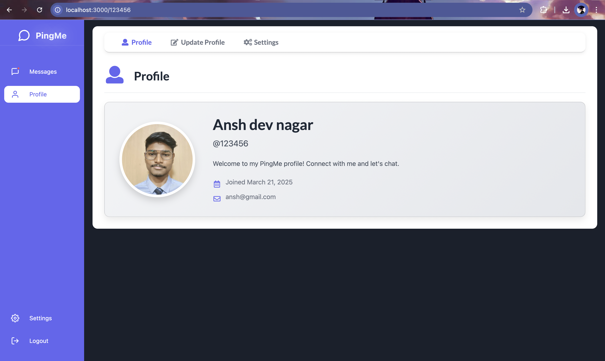
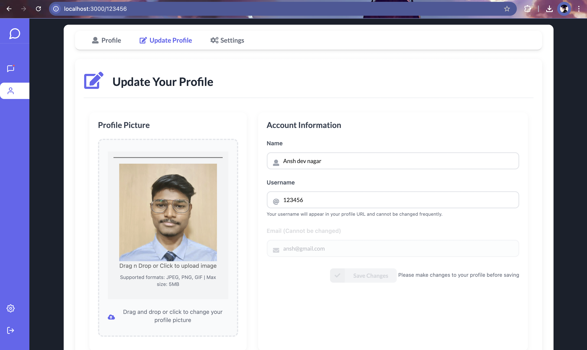
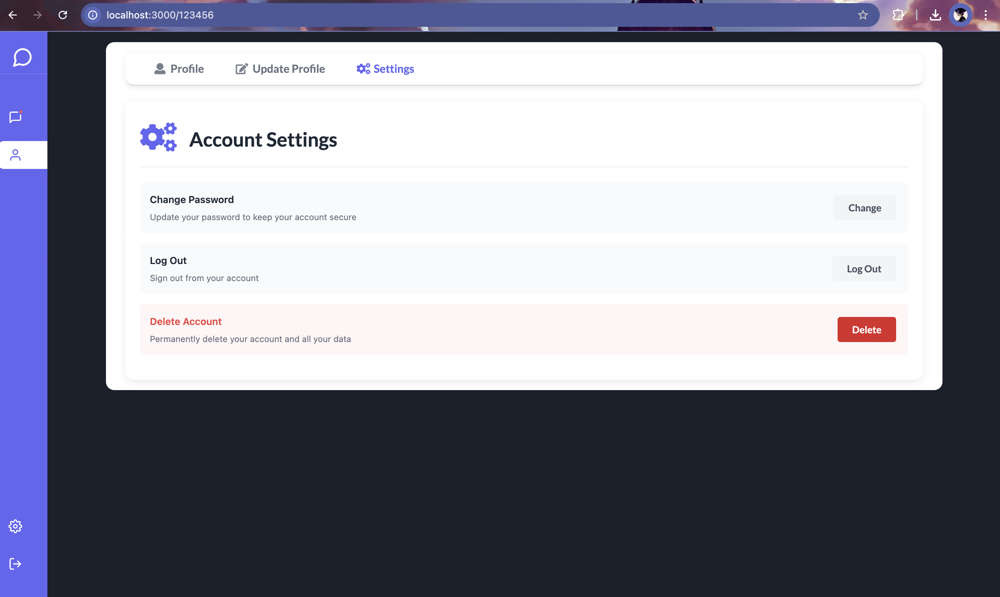

# PingMe - Modern Real-time Chat Application

A full-featured, real-time messaging application built with Next.js, Express, MongoDB, and Socket.io. This project delivers a seamless communication experience with a focus on modern design, real-time updates, and intuitive user interactions.

## Project Overview

PingMe is developed to provide a feature-rich chat platform with real-time messaging capabilities. The application features a responsive design with a clean, modern UI that adapts across devices, focusing on both functionality and visual appeal.

## Screenshots

### Sign In


*Clean sign-in interface with elegant form design*

### Sign Up


*User-friendly registration form with profile image upload capability*

### Chat Interface


*Modern chat interface with real-time messaging and online status indicators*

### Profile View


*User profile display with clean layout and statistics*

### Update Profile


*Easy-to-use profile update form with image upload functionality*

### Settings


*Account settings with password management options*

## Core Features

### Current Implementation
* **Real-time Messaging**: Instant message delivery and receipt using Socket.io
* **User Authentication**: Secure signup and login functionality
* **Persistent Storage**: MongoDB database for message and user data
* **Profile Management**: User profiles with customizable images and information
* **Real-time Status**: Online/offline indicators for users
* **Message Management**: Delete messages with proper notification
* **Chat History**: Persistent chat history organized by date
* **User Search**: Find and start conversations with other users
* **Responsive Design**: Adapts seamlessly to desktop and mobile devices
* **Modern UI**: Clean interface with intuitive navigation

### Technical Stack

* **Frontend**: Next.js, React, Semantic UI
* **Backend**: Express.js, Socket.io
* **Database**: MongoDB
* **Authentication**: JWT, bcrypt
* **Real-time Communication**: Socket.io
* **CSS**: Custom styling with responsive design principles

## Setup Guide

1. Clone the repository:
```bash
git clone https://github.com/Ansh-Dev-Nagar/PingMe.git
cd PingMe
```

2. Install dependencies:
```bash
npm install
```

3. Create a `config.env` file in the root directory with the following variables:
```
MONGO_URI=your_mongodb_connection_string
JWT_SECRET=your_jwt_secret
PORT=3000
```

4. Start the development server:
```bash
npm run dev
```

The application will be available at `http://localhost:3000`

## Environment Variables

- `MONGO_URI`: MongoDB connection string
- `JWT_SECRET`: Secret key for JWT token generation
- `PORT`: Server port (default: 3000)

## Development Notes

### Real-time Communication
The application uses Socket.io to enable real-time bidirectional communication between users. This ensures that messages are delivered instantly and users receive immediate notifications.

### User Experience
PingMe is designed with user experience as a priority, featuring:
- Clear visual separation between conversations
- Date-based message grouping
- Intuitive search functionality
- Smooth animations and transitions
- Visual feedback for all interactions

### Security
Authentication is handled with JWT tokens and passwords are securely hashed using bcrypt. All API endpoints are protected to ensure data privacy and security.

## Prerequisites

- Node.js (v14 or higher)
- MongoDB
- npm or yarn

## Contributing

Contributions are welcome. Please follow these steps:
1. Fork the repository
2. Create a feature branch
3. Submit a pull request with detailed description
4. Ensure all tests pass

## Contact

For inquiries or collaboration opportunities, please reach out through:
anshdevnagar@gmail.com

---
Developed by Ansh Dev Nagar
